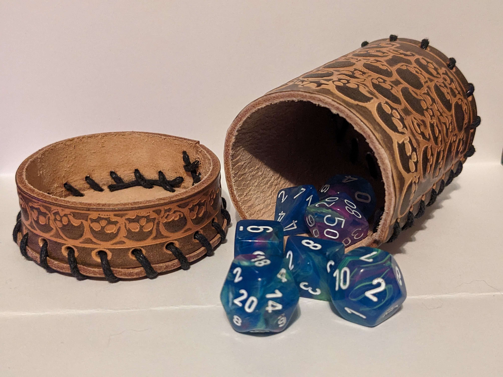

# Dice'n Stuff
 capstone-project

## Description

A five page e-commerce website including a homepage, a login page, a registration page, a products page, and a shopping cart page- [Github Project Location](https://github.com/VictorPadilla0861/CapstoneProject)

## Page 1
A homepage with a carousel of products listed and a footer

        
        

        
'

### page-image

## Page 2
A login page that directs you back to the homepage
        
        <label for="inputPassword4">Password</label>
            <input type="password" class="form-control" id="inputPassword4" placeholder="Password" required>
### page-image

## Page 3
A registration page with fillable form and dropdown selectors
       
          

          

            <label for="inputCity">City</label>
            <input type="text" class="form-control" id="inputCity">
        

           
            

            <label for="inputCity">State</label>
            <input type="text" class="form-control" id="inputCity">
            

### page-image

## Page 4
A products page with a row of cards displaying products
       
         <section style="margin-top: 5%;">
        

          

            

              

                

                  
<button class="btn btn-outline-success" type="submit">Add to Cart</button>
                  

                  

                    
x4

                  

                

                
                

                  

                    
<a href="#!" class="text-muted">Dice</a>

                    
<s>$35</s>

                  

### page-image

## Page 5
A shopping cart page with payment fields and a numbered cart
       
         

               

                

                    

                      <h5 class="mb-0">Cart - 3 items</h5>
                    

                    

                      <!-- Single item -->
                      

                        

                          <!-- Image -->
                          

                            
                            <a href="#!">
                              

                            </a>
                          

### page-image

## Authors

* Victor Padilla

-https://github.com/VictorPadilla0861

## Ackowledgements

* Bootsrap v5.3
* Instructor : Remsey Milijard
* My homies at Year-Up